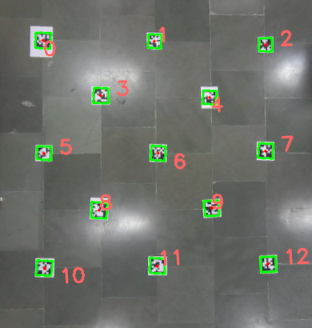

# Configuring the Testbed

__The test bed is currently using a single ceiling camera for the global view. As a result, the configuration of the testbed consists of intrinsically calibrating the camera and finding the homography between the image plane and the ground plane.__

## Calibration

Open the calibration folder in the `homography_and_calibration` directory. Out of the two python scripts present in the folder, `calib_images.py` is used to capture images with the checkerboard pattern placed at different orientations and locations, and `calib.py` is used to calibrate the camera based on the images captured using `calib_images.py`.

To capture images using `calib_images.py`, connect the ceiling camera to your device and run the script. Place the checkerboard pattern at different orientations and distances and capture the image using the `S` key. Close the script with the `ESC` key. The images get saved inside the `calibration_images` folder. Some sample images which produced good calibration results (*with reprojection error of 0.03*) are present in the folder for reference.

The result of the calibration is saved in a `git3_calib_best.npz` file. Since the camera’s intrinsic parameters never change, calibration is a one time process. Save the `.npz`  format file obtained in the source folder of the testbed repository, and the homography folder in the `homography_and_calibration` directory. I have included a sample `git3_calib_best.npz` for the gitup camera present in the lab.

## Homography 

After calibrating the camera, go to the `homography` directory in the `homography_and_calibration` directory. In this step of configuration, we are going to find point correspondences between the some of the image pixels and their real world coordinates (in cms)  on the ground.  
To find the homography, I took the following steps:   
1. Arbitrarily select a point on the real world ground plane as `Origin[0,0]`, and with respect to the Origin, place the april tags uniformly and note the `(x,y)` coordinates of their centers in cm. Make sure that all the april tags are detectable by the camera and they are in order(*that is the april tag placed at origin should have ID0, the next tag in the x axis should have ID1, and so on..*) as illustrated in the picture. 

2. Update the `ground_truth` list in the `homography.py` code, by plugging in the `(x,y)` coordinates in cms. Leave the `scale_factor` unchanged.  
3. Execute the `find_homography.py` file. . . If everything was done correctly, the code should output a file called `homography.npz`, and the final view after the perspective transform. To check the accuracy of the code, place an april tag of `tag_ID 12` in the field of view of the camera and compare its height and width (in cms) to that displayed on the terminal.  
4. Copy and save the `homography.npz`  format file in the source folder of the testbed repository.

__The configuration is a one time process which yields two files:__  
1. `git3_calib_best.npz`  
2. `homography.npz`

These two files are the foundation on which the application and uses of the testbed depends. Before running the codes in the `source` directory of this repository, make sure that:  
1. The ceiling camera is mounted carefully and tightly. If the angle of the camera with respect to the ground changes, you need to calculate the homography again.  
2. The ceiling camera should not be changed with a different model. In that case you would need to reconfigure the testbed.

