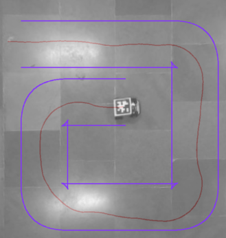

# Source Directory
__This directory contains python scripts with use cases of the test bed.__

As of now the testbed can be used for the following applications:  
__1. Overlaying a road network  
2. mapping the trajectory of a moving vehicle__

## Overlaying a road Network:
1. For overlaying a road network, you need to make a suitable road network using sumo's netedit tool. Refer to the following tutorials: https://sumo.dlr.de/docs/Tutorials.html. The road network created using sumo is be of the format `.net.xml` and should be saved at the path `../custom_scenarios/sumo_network`. This will ensure smooth working of code.

2. After creating the road network in netedit and saving it in the `../custom_scenarios/sumo_network` directory, run the following command in a terminal at the source directory: `python3 generate_network.py -i <name_of_your_file>.net.xml`. This will convert the given sumo road network to both, a commonroad scenario `.xml` file and `.json` file, both with the same name as `name_of_your_file`. They are saved at paths   `../custom_scenarios/commonroad_network` and `../custom_scenarios/json_network` respectively.

3. After the creation of the `.json` file,connect the ceiling camera to your computer,and  in the source directory run the command `python3 overlay.py -i <name_of_your_file>.json`.

You should see a video feed similar to the image as shown below.  
  

`overlay.py` has tuneable parameters like `CAR_WIDTH` and `ORIGIN` in the main function. The `ORIGIN` parameter can be tuned to properly position the road network over the camera frame, and  the `CAR_WIDTH` can be used to resize the road network so that the car can fit properly on the road.

## Mapping the Trajectory of a Moving Vehicle
1. To map the trajectory of a moving vehicle(or a robot) on the hardware test bed, first use an april tag of `tag_id=1` and place it over the vehicle. Make sure that the tag is facing ceiling camera and the camera can detect it.  
2. Run the command `python3 trajectory.py -i <name_of_network_file>.json` in the source directory. Make sure the vehicle is in the camera's field of view.  
3. If you are using the jet racer for the test bed, turn it on and control it using the example script `teleoperation.ipynb` the remote controller. The script, `trajectory.py` will mark the trajectory of the car as it moves on the test bed. Refer to the picture below.  
  

Rest of the scripts help in seemless running of the above mentioned applications. If you want to add a functionality to the codebase, you can study working of the entire pipeline.

## Common Errors  
While compiling the repository and running the codes, you may run into the following errors:  
 __1.__ While running overlay.py or trajectory.py, you may encounter an error message that the ceiling camera cant be detected. In that case, make sure that the camera is connected properly. If nothing seems to work, open the file that is not working in a text editor, identify the line in which video feed is being capured (it should look something like `capture=cv2.VideoCapture(1)`), and try putting some other numbers instead of `1` in the argument. Normally, `2` should work fine.
 
 __2.__ While running generate_network.py, if no matplotlib window is being displayed, refer to the following link: https://www.pyimagesearch.com/2015/08/24/resolved-matplotlib-figures-not-showing-up-or-displaying/

